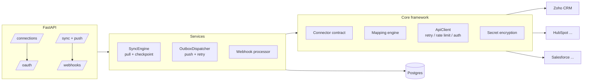

# Integration Hub

A provider-agnostic backend for **pulling** data from and **pushing** data to third-party SaaS
systems. Zoho CRM is the first integration; every other system plugs into the same contract.

## Architecture



### Layers

| Layer | Location | Responsibility |
| --- | --- | --- |
| Core contract | [src/integration_hub/core/base.py](src/integration_hub/core/base.py) | `Connector`, `StreamSpec`, `Cursor`, `Record`, `WriteResult` — the only thing a new provider implements |
| Transport | [src/integration_hub/core/http.py](src/integration_hub/core/http.py) | Token bucket rate limiting, exponential backoff, `Retry-After`, 401 re-auth, error normalisation |
| Mapping | [src/integration_hub/core/mapping.py](src/integration_hub/core/mapping.py) | Declarative bidirectional field maps + transform registry |
| Canonical model | [src/integration_hub/core/canonical.py](src/integration_hub/core/canonical.py) | Provider-neutral `Contact` / `Company` / `Lead` / `Deal` |
| Registry | [src/integration_hub/core/registry.py](src/integration_hub/core/registry.py) | Auto-discovers providers under `providers/` |
| Pull | [src/integration_hub/services/sync.py](src/integration_hub/services/sync.py) | Paged incremental reads, per-page checkpointing, run history |
| Push | [src/integration_hub/services/outbox.py](src/integration_hub/services/outbox.py) | Transactional outbox, idempotency keys, batching, retries, dead letters |
| Webhooks | [src/integration_hub/services/webhooks.py](src/integration_hub/services/webhooks.py) | Dedupe, persist raw payload, hydrate the changed record |
| Scheduler | [src/integration_hub/worker.py](src/integration_hub/worker.py) | Due-stream polling + outbox draining |

### Design decisions

- **One contract, many providers.** Scheduling, retries, encryption, checkpointing, webhooks and
  the REST API are provider-independent. A new integration only supplies streams, mappings, auth
  and API calls.
- **Canonical model in the middle.** Providers never talk to each other directly, so adding the
  Nth system is O(1) rather than O(N²) mappings.
- **At-least-once with dedupe.** Inbound records are content-hashed before landing, so replays are
  idempotent. Outbound writes carry an idempotency key so retries do not duplicate records.
- **Cursor checkpointing per page.** A crash replays at most one page.
- **Credentials encrypted at rest** with Fernet; token rotation is persisted through a callback so
  the connector never owns storage.
- **Webhooks converge with polling.** A notification only tells us *which* ids changed; the record
  is then fetched through the same read path, so both paths produce identical output.

## Data model

`connections` → `stream_states` (cursor + schedule) → `sync_runs` (history),
`staged_records` (pull landing zone), `outbox_items` (push queue), `record_links`
(local ↔ remote id), `webhook_deliveries`, `webhook_subscriptions`, `dead_letters`.

## Quick start

```powershell
python -m venv .venv
.\.venv\Scripts\python.exe -m pip install -e ".[dev]"
Copy-Item .env.example .env
# generate the encryption key
.\.venv\Scripts\python.exe -c "from cryptography.fernet import Fernet; print(Fernet.generate_key().decode())"
.\.venv\Scripts\python.exe -m uvicorn integration_hub.main:app --reload
```

Interactive docs: <http://localhost:8000/docs>. All `/v1` endpoints require the `X-API-Key` header
when `SERVICE_API_KEY` is set (webhook receivers are excluded — they authenticate via the
provider's own token).

### End-to-end flow

```powershell
# 1. create the connection
curl -X POST http://localhost:8000/v1/connections -H "Content-Type: application/json" -d '{
  "tenant_id":"acme","provider":"zoho_crm","name":"Acme Zoho","config":{"dc":"com"}}'

# 2. authorize (open the returned URL in a browser and consent as the Zoho user)
curl "http://localhost:8000/v1/oauth/zoho_crm/authorize?connection_id=<ID>"

# 3. verify + inspect the remote schema
curl -X POST http://localhost:8000/v1/connections/<ID>/test
curl http://localhost:8000/v1/connections/<ID>/schema/contacts

# 4. enable streams (the scheduler now polls them)
curl -X PUT http://localhost:8000/v1/connections/<ID>/streams -H "Content-Type: application/json" \
  -d '[{"stream":"contacts","schedule_seconds":300},{"stream":"deals","schedule_seconds":900}]'

# 5. pull now / read what landed
curl -X POST http://localhost:8000/v1/connections/<ID>/sync -H "Content-Type: application/json" \
  -d '{"stream":"contacts","full_refresh":true}'
curl http://localhost:8000/v1/connections/<ID>/records/contacts

# 6. push canonical records back
curl -X POST http://localhost:8000/v1/connections/<ID>/push -H "Content-Type: application/json" -d '{
  "stream":"contacts","mode":"upsert","queue":true,
  "records":[{"first_name":"Ada","last_name":"Lovelace","email":"ada@example.com"}]}'

# 7. near-real-time change notifications
curl -X POST http://localhost:8000/v1/connections/<ID>/webhooks -H "Content-Type: application/json" \
  -d '{"streams":["contacts","deals"]}'
```

CLI equivalents: `ihub providers`, `ihub sync <connection_id> <stream>`, `ihub flush-outbox`.

---

## What is needed on the Zoho side

### 1. Register an OAuth client

1. Sign in to the **Zoho API Console** for the customer's data centre:
   `https://api-console.zoho.com` (or `.eu`, `.in`, `.com.au`, `.jp`, `.ca`, `.sa`, `.com.cn`).
2. **Add Client → Server-based Applications**.
3. Authorized redirect URI must match `ZOHO_REDIRECT_URI` **exactly**, e.g.
   `https://api.yourdomain.com/v1/oauth/zoho_crm/callback` (HTTPS in production).
4. Copy **Client ID** and **Client Secret** into `ZOHO_CLIENT_ID` / `ZOHO_CLIENT_SECRET`.

> Multi-DC note: a Zoho org lives in exactly one data centre. The callback receives `location`
> and `accounts-server`; we persist it on the connection as `config.dc` and use the `api_domain`
> returned with the token, so you never hardcode `zohoapis.com`.

### 2. Scopes to request

Requested by default in [providers/zoho_crm/auth.py](src/integration_hub/providers/zoho_crm/auth.py):

| Scope | Why |
| --- | --- |
| `ZohoCRM.modules.ALL` | Read/create/update/delete records (narrow to `ZohoCRM.modules.contacts.READ` etc. for least privilege) |
| `ZohoCRM.settings.modules.READ`, `ZohoCRM.settings.fields.READ` | Schema discovery, custom-field mapping |
| `ZohoCRM.users.READ`, `ZohoCRM.org.READ` | Owner resolution and connection health check |
| `ZohoCRM.notifications.ALL` | Instant change notifications (webhooks) |
| `ZohoCRM.coql.READ` | Query-based extraction for large/filtered pulls |
| `ZohoCRM.bulk.ALL` | Optional: bulk read/write jobs for very large backfills |

### 3. The user who authorizes

- Must be an **active CRM user in the target org**, ideally a dedicated **integration user** with
  an Administrator (or a purpose-built) profile.
- Their **data-sharing / role visibility determines what the API returns** — a restricted user
  silently yields fewer records. Give the integration user org-wide read access if you need a
  complete copy.
- The refresh token is bound to that user. If they are deactivated, syncing stops — hence a
  service account rather than an employee account.

### 4. Operational limits to agree on

- **Refresh tokens**: max 20 per user/client; the oldest is revoked when you exceed it. Only one
  refresh token is issued per authorization, and only with `access_type=offline` +
  `prompt=consent`. Access tokens last 1 hour (handled automatically).
- **API credits**: a per-org daily quota based on edition and user count. Concurrency is also
  capped. Tune `config.rate_per_second` on the connection if the org is small.
- **Page size**: 200 records per read; **100 records per write batch** — enforced by the client.
- **Deletes**: hard deletes are not visible in normal reads. We poll `/{module}/deleted` and mark
  `staged_records.deleted`.
- **Webhooks (Notification API)**: `notify_url` must be a publicly reachable HTTPS endpoint, and
  channels expire in at most 24 hours, so they must be re-registered (the connector sets a 23h
  expiry). Payloads carry a `token` you choose — set `ZOHO_WEBHOOK_TOKEN` and we verify it.
- **Sandbox**: use a Zoho CRM sandbox org for non-production environments; it needs its own
  client + connection.

### 5. Checklist to send to the Zoho admin

- [ ] Data centre of the org (`com` / `eu` / `in` / `com.au` / `jp` / `ca` / `sa` / `com.cn`)
- [ ] Client ID + Client Secret from the API console (Server-based Application)
- [ ] Redirect URI whitelisted
- [ ] Dedicated integration user created, licensed, and consenting to the scopes above
- [ ] Modules in scope and any **custom fields** that must be mapped
- [ ] Confirmation that workflow rules should or should not fire on our writes (`trigger` is sent
      empty by default, which suppresses them)
- [ ] Allow-list our egress IPs if the org restricts API access

---

## Adding another provider

1. Create `src/integration_hub/providers/<name>/`.
2. Subclass `Connector`, decorate with `@register_connector`, and implement:
   `streams()`, `mapping()`, `check_connection()`, `read()`, `write()`
   (+ optional `describe()`, `register_webhook()`, `parse_webhook()`).
3. Declare field maps with `FieldMap` / `ObjectMapping` against the canonical models.
4. Build the HTTP layer on `ApiClient` so you inherit retries and rate limiting.
5. Register the OAuth module with `register_oauth_provider` if the provider uses OAuth.

Nothing else changes: scheduling, checkpointing, outbox, webhooks, encryption and the REST API
work immediately.

## Production notes

- Swap the in-process `Worker` for Celery/arq beat; the unit of work (`SyncEngine.run_stream`)
  is unchanged.
- Use Postgres and generate Alembic migrations (`init_models()` is dev-only).
- Store `SECRET_ENCRYPTION_KEY` in a KMS/secret manager and plan for key rotation.
- Ship `sync_runs` and `dead_letters` metrics to your monitoring stack; alert on connections
  moving to `pending_auth` (revoked tokens).
